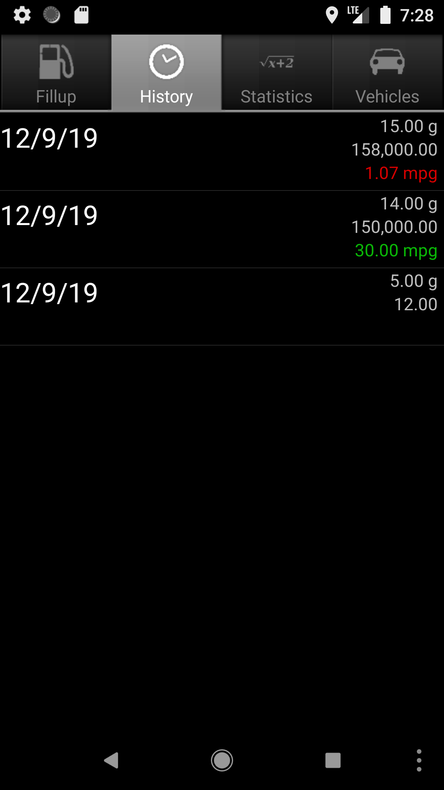
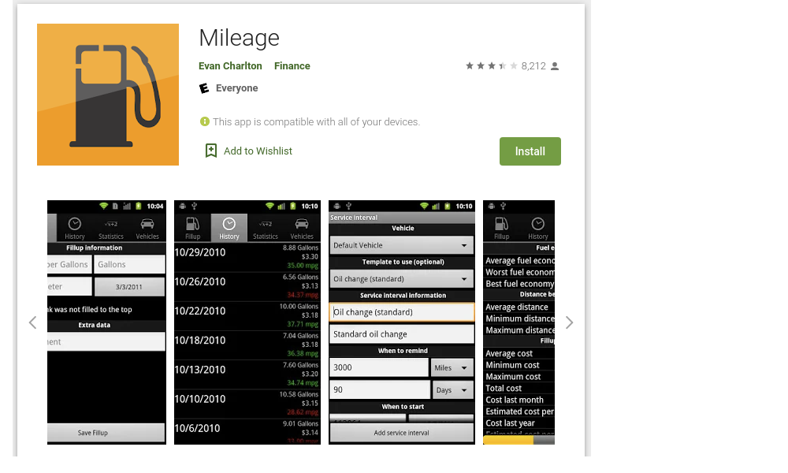

# Estrategia de pruebas - Parcial 2

---

## Cracterísticas de la App

**Mileage**

La descripción de Mileage

El kilometraje le permite calcular el kilometraje de su automóvil de una manera simple y directa para evaluar su economía de combustible. Simplemente ingrese una distancia (en millas o kilómetros) y una cantidad de gas (en galones o litros) y calculará por usted:

1. Millas por galón
2. Galones por 100 millas
3. Kilómetros por litro
4. Litros por 100 kilómetros

Con esa información es posible usar características adicionales y que son calculos simples como:

* cuánto cuestan varios litros de gasolina?
* Costo de reparaciones e impuestos
* Recordatorios de mantenimiento

La aplicación cuenta con `8,212` reviews y una calificación de `3.4` en Google Play.

**Version:** 3.1.1 Ultima Actualizacion Febrero 5, 2013

**Version de Android mínima:** 4

## Contexto

### Objetivos

* Realizar Pruebas exploratorias sobre la aplicación movil Mileage para conocer cuales son sus principales funcionalidades.
* Evaluar la calidad de la suite de pruebas usando los mutantes creados. 
* Realizar Pruebas VRT con apk bueno y los mutantes para hallar posibles fallos que no se puedan hallar a simple vista. 
* Presentar reportes de cada prueba para su analisis. 
* Automatizar escenarios básicos que no esten contemplados en la suite de pruebas. 
* Construir una aplicación que automatice la prueba sobre los mutantes y sobre la aplicacion limpia y reportar los fallos detectados. 

### Niveles y tipos de prueba

**Sistema**

* Se realizará un proceso de BDD sobre el APK instalado en un dispositivo Android emulado probando la aplicación como un sistema completo.
* Por cada escenario de las pruebas BDD se toma un screenshot, esto se hace en cada mutante para luego ser comparado con el apk limpio. 
* Se hace VRT por cada screenshot del mutante con los screenshot del apk limpio y se geenra un reporte automaticamente con el worker. 

**Aceptación**

* Durante el proceso de exploración se realizara una prueba de aceptación en un dispositivo Android real de forma manual.

### Infraestructura de pruebas

**Hardware:**

* Computador MSI con sistema operativo Ubuntu 18.04, 16GB RAM, 512GB estado solido, core i7.
* Computador Dell inspiron 15 7000 gaming con sistema operativo ubuntu 18.04, 16 GB de ram, 1 TB de estado solido, core i7. 
* Celular HUAWEI P20 Lite VERSION DE ANDROID 9.
* Emulador Nexus 5, API 27, Android 8.1, 2GB

**Software:**

* Android Studio
* Mileage original APK provista por el monitor de la clase como la versión estable de la aplicación.
* Mileage APK's mutantes provistos por el monitor de la clase como la versión inestable de la aplicación.
* Calabash para automatización de pruebas sobre Android
* pixelmatch para hacer evidencia de ejecución de pruebas de sistema y hacer VRT sobre las imagenes generadas.
* Aplicación original descargada y compilada desde el repositorio base.

**Recurso Humano:**

2 desarrolladores trabajando 2 horas diarias durante 6 días continuos.

### Proceso de deteccion de errores 

El proceso a seguir para encontrar los defectos detectados en los mutantes es:

1. Instalar APK 
2. Ejecutar pruebas de calabash
3. Ejecutar pruebas de VRT
4. Creacion de reportes de todas las pruebas automaticamwente
5. Leer resultados 

Primero se va a realizar el proceso de pruebas sobre el APK original con el objetivo de encontrar una muestra base del comportamiento de la aplicación sin defectos inyectados, esta prueba inicial busca determinar la cantidad de defectos que pueden ser hallados usando las pruebas de calabash y VRT codificadas por nosotros.

Se realizo un informe completo de todas las funcionalidades disponibles sobre Mileage.

## Resultados

* PRUEBAS CON CALABASH 
* VRT usando PixelMatch 

--- Resultados -- 

[Resultados](https://github.com/aromero45/parcial-2-pruebas-apk-bueno/blob/master/report/Reporte%20de%20mutantes%20encontrados.xlsx)

## Herramienta de automatización 

---

Se realizo una herramienta de automatización sobre comando node app.js que hace lo siguiente:

1. Crear carpeta de resultados del mutante.
2. Copiar el APK del mutante.
3. Firmal el APK, debido a que la copia firmada no funcionaba.
4. Ejecutar las pruebas de Calabash.
5. Generar las imagenes para hacer VRT.
6. Copiar los resultados de Calabash.
7. Con PixelMatch generar las comparaciones de VRT. 
8. Generar reporte de comparacion para VRT.
9. Guardar todos los reportes generados en la carpeta de resultados. 

## Conclusiones

---

### BDT

* Todos los escenarios de pruebas tienen una toma de screenshot apenas haga su proceso. 
* Los escenarios de pruebas construidos en Calabash se hicieron tal para detectar errores comunes en el apk. 
* Los escenarios propuestos no eran buenos detectando errores en la parte visual, es decir cambios en colores, posiciones, numeros aleatorios, etc.

### VRT

* con PixelMatch se detecta cambios visuales entre las diferentes imagenes generadas por cada escenario en Calabash. 

### Repositorio

* Se sube todo a este repositio, el worker, los escenarios en calabash y los resultados de todas las pruebas en los mutantes que seleccionamos. 

### Ejecución de pruebas

* El tiempo fue la mayor limitación para ejecutar las pruebas de forma completa.
* El telefono o emulador en cada prueba queda con mucha informacion basura, haciendo que el espacio requerido en el celular o emulador sea mayor. 
* Los mutantes más fáciles de detectar son los mutantes detectados por BDD, ya que no se podian ingresar algunas opciones y fallaba los escenarios. 

## Referencias

---

* [Mileage](https://github.com/evancharlton/android-mileage)
* [Mileage - Google Play](https://play.google.com/store/apps/details?id=com.evancharlton.mileage&hl=en_US)

