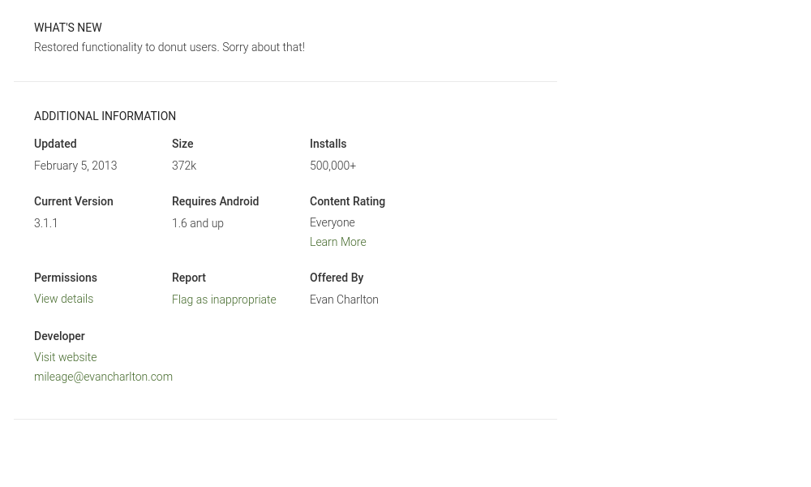

# Estrategia de pruebas - Parcial 2

---

## Características de la App

**Mileage**

La descripción de Mileage

El kilometraje le permite calcular el kilometraje de su automóvil de una manera simple y directa para evaluar su economía de combustible. Simplemente ingrese una distancia (en millas o kilómetros) y una cantidad de gas (en galones o litros) y calculará por usted:

1. Millas por galón
2. Galones por 100 millas
3. Kilómetros por litro
4. Litros por 100 kilómetros

Con esa información es posible usar características adicionales y que son calculos simples como:

* cuánto cuestan varios litros de gasolina?
* Costo de reparaciones e impuestos
* Recordatorios de mantenimiento

La aplicación cuenta con `8,212` reviews y una calificación de `3.4` en Google Play.

**Version:** 3.1.1 Ultima Actualizacion Febrero 5, 2013

**Version de Android mínima:** 4

## Contexto

### Objetivos

* Realizar Pruebas exploratorias sobre la aplicación movil Mileage para conocer cuales son sus principales funcionalidades.
* Evaluar la calidad de la suite de pruebas usando los mutantes creados. 
* Realizar Pruebas VRT con apk bueno y los mutantes para hallar posibles fallos que no se puedan hallar a simple vista. 
* Presentar reportes de cada prueba para su analisis. 
* Automatizar escenarios básicos que no esten contemplados en la suite de pruebas. 
* Construir una aplicación que automatice la prueba sobre los mutantes y sobre la aplicacion limpia y reportar los fallos detectados. 

### Niveles y tipos de prueba

**Sistema**

* Se realizará un proceso de BDD sobre el APK instalado en un dispositivo Android emulado probando la aplicación como un sistema completo.
* Por cada escenario de las pruebas BDD se toma un screenshot, esto se hace en cada mutante para luego ser comparado con el apk limpio. 
* Se hace VRT por cada screenshot del mutante con los screenshot del apk limpio y se geenra un reporte automaticamente con el worker. 

**Aceptación**

* Durante el proceso de exploración se realizara una prueba de aceptación en un dispositivo Android real de forma manual.

### Infraestructura de pruebas

**Hardware:**

* Computador MSI con sistema operativo Ubuntu 18.04, 16GB RAM, 512GB estado solido, core i7.
* Computador Dell inspiron 15 7000 gaming con sistema operativo ubuntu 18.04, 16 GB de ram, 1 TB de estado solido, core i7. 
* Celular HUAWEI P20 Lite VERSION DE ANDROID 9.
* Emulador Nexus 5, API 27, Android 8.1, 2GB

**Software:**

* Android Studio
* Mileage original APK provista por el monitor de la clase como la versión estable de la aplicación.
* Mileage APK's mutantes provistos por el monitor de la clase como la versión inestable de la aplicación.
* Calabash para automatización de pruebas sobre Android
* pixelmatch para hacer evidencia de ejecución de pruebas de sistema y hacer VRT sobre las imagenes generadas.
* Aplicación original descargada y compilada desde el repositorio base.

**Recurso Humano:**

2 desarrolladores trabajando 2 horas diarias durante 6 días continuos.

### Proceso de deteccion de errores 

El proceso a seguir para encontrar los defectos detectados en los mutantes es:

1. Instalar APK 
2. Ejecutar pruebas de calabash
3. Ejecutar pruebas de VRT
4. Creacion de reportes de todas las pruebas automaticamwente
5. Leer resultados 

Primero se va a realizar el proceso de pruebas sobre el APK original con el objetivo de encontrar una muestra base del comportamiento de la aplicación sin defectos inyectados, esta prueba inicial busca determinar la cantidad de defectos que pueden ser hallados usando las pruebas de calabash y VRT codificadas por nosotros.

Se realizo un informe completo de todas las funcionalidades disponibles sobre Mileage.

## Resultados

* PRUEBAS CON CALABASH 
* VRT usando PixelMatch 

--- Resultados -- 

En el siguiente link se encuentra un archivo de excel con los resultados de las 831 pruebas realizadas sobres los diferentes mutantes, con sus respectivos reportes de errores encontrados y los links a las carpetas en el repositorio.

[Resultados de pruebas sobre los mutantes](https://github.com/aromero45/parcial-2-pruebas-apk-bueno/blob/master/report/Reporte%20de%20mutantes%20encontrados.xlsx)

|Mutante|Descripcion|Reporte|
| ------------- | ------------- | ------------- |
|1|esceniario ir a estadisticas fallo, no se hace scroll down no carga estadisticas|https://github.com/aromero45/parcial-2-pruebas-apk-bueno/tree/master/report/mutante1|
|2|esceniario ir a estadisticas fallo, no se hace scroll down no carga estadisticas|https://github.com/aromero45/parcial-2-pruebas-apk-bueno/tree/master/report/mutante2|
|3|No carga Estadisticas|https://github.com/aromero45/parcial-2-pruebas-apk-bueno/tree/master/report/mutante3|
|4|No carga Estadisticas|https://github.com/aromero45/parcial-2-pruebas-apk-bueno/tree/master/report/mutante4|
|5|No carga Estadisticas|https://github.com/aromero45/parcial-2-pruebas-apk-bueno/tree/master/report/mutante5|
|6|Nacido Muerto|https://github.com/aromero45/parcial-2-pruebas-apk-bueno/tree/master/report/mutante6|
|7|Nacido Muerto|https://github.com/aromero45/parcial-2-pruebas-apk-bueno/tree/master/report/mutante7|
|26|diferencia visual en agregar new service intervals|https://github.com/aromero45/parcial-2-pruebas-apk-bueno/tree/master/report/mutante26|
|30|escenario ver vehiculo crear intervalo de servicio , no se puede agregar un add service intervals|https://github.com/aromero45/parcial-2-pruebas-apk-bueno/tree/master/report/mutante30|
|31|escenario ver vehiculo crear intervalo de servicio , no se puede agregar un add service intervals|https://github.com/aromero45/parcial-2-pruebas-apk-bueno/tree/master/report/mutante31|
|32|escenario ver vehiculo crear intervalo de servicio , no se puede agregar un add service intervals|https://github.com/aromero45/parcial-2-pruebas-apk-bueno/tree/master/report/mutante32|
|33|escenario ver vehiculo crear intervalo de servicio , no se puede agregar un add service intervals|https://github.com/aromero45/parcial-2-pruebas-apk-bueno/tree/master/report/mutante33|
|34|escenario ver vehiculo crear intervalo de servicio , no se puede agregar un add service intervals|https://github.com/aromero45/parcial-2-pruebas-apk-bueno/tree/master/report/mutante34|
|35|escenario ver vehiculo crear intervalo de servicio , no se puede agregar un add service intervals|https://github.com/aromero45/parcial-2-pruebas-apk-bueno/tree/master/report/mutante35|
|36|escenario ver vehiculo crear intervalo de servicio , no se puede darle clear al field title.|https://github.com/aromero45/parcial-2-pruebas-apk-bueno/tree/master/report/mutante36|
|37|escenario ver vehiculo crear intervalo de servicio , no se puede agregar un add service intervals|https://github.com/aromero45/parcial-2-pruebas-apk-bueno/tree/master/report/mutante37|
|38|escenario ver vehiculo crear intervalo de servicio , no se puede agregar un add service intervals|https://github.com/aromero45/parcial-2-pruebas-apk-bueno/tree/master/report/mutante38|
|41|Escenario historial, no se puede editar historial|https://github.com/aromero45/parcial-2-pruebas-apk-bueno/tree/master/report/mutante41|
|42|Escenario historial, no se puede editar historial|https://github.com/aromero45/parcial-2-pruebas-apk-bueno/tree/master/report/mutante42|
|43|Escenario historial, no se puede editar historial|https://github.com/aromero45/parcial-2-pruebas-apk-bueno/tree/master/report/mutante43|
|44|Escenario historial, no se puede editar historial. escenario ver vehiculo crear intervalo de servicio , se cae la aplicacion|https://github.com/aromero45/parcial-2-pruebas-apk-bueno/tree/master/report/mutante44|
|45|Escenario historial, no se puede editar historial|https://github.com/aromero45/parcial-2-pruebas-apk-bueno/tree/master/report/mutante45|
|46|Escenario historial, no se puede editar historial|https://github.com/aromero45/parcial-2-pruebas-apk-bueno/tree/master/report/mutante46|
|47|Escenario historial, no se puede editar historial|https://github.com/aromero45/parcial-2-pruebas-apk-bueno/tree/master/report/mutante47|
|53|Escenario historial, falla ver historial y editarlo.|https://github.com/aromero45/parcial-2-pruebas-apk-bueno/tree/master/report/mutante53|
|55|Escenario historial, falla ver historial y editarlo.|https://github.com/aromero45/parcial-2-pruebas-apk-bueno/tree/master/report/mutante55|
|56|Escenario historial, falla ver historial y editarlo.|https://github.com/aromero45/parcial-2-pruebas-apk-bueno/tree/master/report/mutante56|
|57|Escenario historial, falla ver historial y editarlo.|https://github.com/aromero45/parcial-2-pruebas-apk-bueno/tree/master/report/mutante57|
|58|Escenario estadisticas, falla scroll down |https://github.com/aromero45/parcial-2-pruebas-apk-bueno/tree/master/report/mutante58|
|59|Escenario estadisticas, falla scroll down |https://github.com/aromero45/parcial-2-pruebas-apk-bueno/tree/master/report/mutante59|
|60|No deja agregar vehiculos|https://github.com/aromero45/parcial-2-pruebas-apk-bueno/tree/master/report/mutante60|
|61|No deja agregar vehiculos|https://github.com/aromero45/parcial-2-pruebas-apk-bueno/tree/master/report/mutante61|
|62|No deja agregar vehiculos|https://github.com/aromero45/parcial-2-pruebas-apk-bueno/tree/master/report/mutante62|
|63|No deja agregar vehiculos|https://github.com/aromero45/parcial-2-pruebas-apk-bueno/tree/master/report/mutante63|
|64|No deja agregar vehiculos|https://github.com/aromero45/parcial-2-pruebas-apk-bueno/tree/master/report/mutante64|
|65|Escenario Agregar vehiculo, falla al agregar uno nuevo|https://github.com/aromero45/parcial-2-pruebas-apk-bueno/tree/master/report/mutante65|
|66|Escenario Agregar vehiculo, falla al agregar uno nuevo|https://github.com/aromero45/parcial-2-pruebas-apk-bueno/tree/master/report/mutante66|
|67|No deja agregar vehiculo|https://github.com/aromero45/parcial-2-pruebas-apk-bueno/tree/master/report/mutante67|
|100|Nacido Muerto|https://github.com/aromero45/parcial-2-pruebas-apk-bueno/tree/master/report/mutante100|
|101|Nacido Muerto|https://github.com/aromero45/parcial-2-pruebas-apk-bueno/tree/master/report/mutante101|
|102|Multiples fallas|https://github.com/aromero45/parcial-2-pruebas-apk-bueno/tree/master/report/mutante102|
|103|Multiples fallas|https://github.com/aromero45/parcial-2-pruebas-apk-bueno/tree/master/report/mutante103|
|104|Nacido Muerto|https://github.com/aromero45/parcial-2-pruebas-apk-bueno/tree/master/report/mutante104|
|106|Error en pantalla vehiculos, no deja seleccionar Miles / Litres|https://github.com/aromero45/parcial-2-pruebas-apk-bueno/tree/master/report/mutante106|
|108|No carga Estadisticas|https://github.com/aromero45/parcial-2-pruebas-apk-bueno/tree/master/report/mutante108|
|109|No carga Estadisticas|https://github.com/aromero45/parcial-2-pruebas-apk-bueno/tree/master/report/mutante109|
|110|No carga Estadisticas|https://github.com/aromero45/parcial-2-pruebas-apk-bueno/tree/master/report/mutante110|
|111|Nacido Muerto|https://github.com/aromero45/parcial-2-pruebas-apk-bueno/tree/master/report/mutante111|
|112|Error en pantalla vehiculos, no deja seleccionar Miles / Litres|https://github.com/aromero45/parcial-2-pruebas-apk-bueno/tree/master/report/mutante112|
|115|Error en pantalla vehiculos, no deja seleccionar Miles / Litres|https://github.com/aromero45/parcial-2-pruebas-apk-bueno/tree/master/report/mutante115|
|119|Error al crear intervalos de servicio|https://github.com/aromero45/parcial-2-pruebas-apk-bueno/tree/master/report/mutante119|
|120|Error al crear intervalos de servicio|https://github.com/aromero45/parcial-2-pruebas-apk-bueno/tree/master/report/mutante120|
|121|Pantalla vehiculos - Error al cambiar el nombre del vehiculo|https://github.com/aromero45/parcial-2-pruebas-apk-bueno/tree/master/report/mutante121|
|124|No carga Historial|https://github.com/aromero45/parcial-2-pruebas-apk-bueno/tree/master/report/mutante124|
|125|No carga Historial|https://github.com/aromero45/parcial-2-pruebas-apk-bueno/tree/master/report/mutante125|
|126|Error en pantalla vehiculos, no deja seleccionar Miles / Litres|https://github.com/aromero45/parcial-2-pruebas-apk-bueno/tree/master/report/mutante126|
|130|Diferencia visual en la pantalla de Estadisticas|https://github.com/aromero45/parcial-2-pruebas-apk-bueno/tree/master/report/mutante130|
|132|Nacido Muerto|https://github.com/aromero45/parcial-2-pruebas-apk-bueno/tree/master/report/mutante132|
|133|Escenario Editar Historial - Error al borrar el campo precio|https://github.com/aromero45/parcial-2-pruebas-apk-bueno/tree/master/report/mutante133|
|134|Escenario Editar Historial - Error al presionar el boton de Editar|https://github.com/aromero45/parcial-2-pruebas-apk-bueno/tree/master/report/mutante134|
|135|Multiples fallas - Escenario Editar Historial - Error al presionar el boton de Editar, Error en pantalla vehiculos, no deja seleccionar Miles / Litres|https://github.com/aromero45/parcial-2-pruebas-apk-bueno/tree/master/report/mutante135|
|136|Error en pantalla vehiculos, no deja seleccionar Miles / Litres|https://github.com/aromero45/parcial-2-pruebas-apk-bueno/tree/master/report/mutante136|
|137|Diferencia visual en la pantalla de Estadisticas|https://github.com/aromero45/parcial-2-pruebas-apk-bueno/tree/master/report/mutante137|
|138|Error en pantalla Fillup - Error al presionar boton save Fillup|https://github.com/aromero45/parcial-2-pruebas-apk-bueno/tree/master/report/mutante138|
|139|Nacido Muerto|https://github.com/aromero45/parcial-2-pruebas-apk-bueno/tree/master/report/mutante139|
|140|Error en pantalla Fillup - Error al presionar boton save Fillup|https://github.com/aromero45/parcial-2-pruebas-apk-bueno/tree/master/report/mutante140|
|141|Error en pantalla Fillup - Error al mostrar el teclado|https://github.com/aromero45/parcial-2-pruebas-apk-bueno/tree/master/report/mutante141|
|142|Multiples fallas - Error en pantalla Fillup, Error al mostrar el teclado - Error en intervalo de servicio, Error al presionar el boton Add Service Interval|https://github.com/aromero45/parcial-2-pruebas-apk-bueno/tree/master/report/mutante142|
|143|Error en pantalla Fillup - Error al mostrar el teclado|https://github.com/aromero45/parcial-2-pruebas-apk-bueno/tree/master/report/mutante143|
|144|Error en pantalla Fillup - Error al mostrar el teclado|https://github.com/aromero45/parcial-2-pruebas-apk-bueno/tree/master/report/mutante144|
|145|Error en pantalla Fillup - Error al mostrar el teclado|https://github.com/aromero45/parcial-2-pruebas-apk-bueno/tree/master/report/mutante145|
|146|Error en intervalo de servicio, Error al presionar el boton Add Service Interval|https://github.com/aromero45/parcial-2-pruebas-apk-bueno/tree/master/report/mutante146|
|147|Escenario Editar Historial - Error al presionar el boton de Save Changes|https://github.com/aromero45/parcial-2-pruebas-apk-bueno/tree/master/report/mutante147|
|150|No carga Historial|https://github.com/aromero45/parcial-2-pruebas-apk-bueno/tree/master/report/mutante150|
|160|Diferencia visual en la pantalla de Estadisticas|https://github.com/aromero45/parcial-2-pruebas-apk-bueno/tree/master/report/mutante160|
|166|Diferencia visual en la pantalla de Estadisticas|https://github.com/aromero45/parcial-2-pruebas-apk-bueno/tree/master/report/mutante166|
|169|No carga Estadisticas|https://github.com/aromero45/parcial-2-pruebas-apk-bueno/tree/master/report/mutante169|
|170|Pantalla estadisticas - Error al hacer Scroll Down|https://github.com/aromero45/parcial-2-pruebas-apk-bueno/tree/master/report/mutante170|
|171|Pantalla estadisticas - Error al hacer Scroll Down|https://github.com/aromero45/parcial-2-pruebas-apk-bueno/tree/master/report/mutante171|
|172|Pantalla estadisticas - Error al hacer Scroll Down|https://github.com/aromero45/parcial-2-pruebas-apk-bueno/tree/master/report/mutante172|
|173|Pantalla estadisticas - Error al hacer Scroll Down|https://github.com/aromero45/parcial-2-pruebas-apk-bueno/tree/master/report/mutante173|
|174|No carga Estadisticas|https://github.com/aromero45/parcial-2-pruebas-apk-bueno/tree/master/report/mutante174|
|175|Pantalla estadisticas - Error al hacer Scroll Down|https://github.com/aromero45/parcial-2-pruebas-apk-bueno/tree/master/report/mutante175|
|177|Pantalla estadisticas - Error al hacer Scroll Down|https://github.com/aromero45/parcial-2-pruebas-apk-bueno/tree/master/report/mutante177|
|178|Pantalla estadisticas - Error al hacer Scroll Down|https://github.com/aromero45/parcial-2-pruebas-apk-bueno/tree/master/report/mutante178|
|179|Pantalla estadisticas - Error al hacer Scroll Down|https://github.com/aromero45/parcial-2-pruebas-apk-bueno/tree/master/report/mutante179|
|180|Pantalla estadisticas - Error al hacer Scroll Down|https://github.com/aromero45/parcial-2-pruebas-apk-bueno/tree/master/report/mutante180|
|184|Pantalla estadisticas - Error al hacer Scroll Down|https://github.com/aromero45/parcial-2-pruebas-apk-bueno/tree/master/report/mutante184|
|185|No carga Estadisticas|https://github.com/aromero45/parcial-2-pruebas-apk-bueno/tree/master/report/mutante185|
|189|No carga Estadisticas|https://github.com/aromero45/parcial-2-pruebas-apk-bueno/tree/master/report/mutante189|
|190|No carga Estadisticas|https://github.com/aromero45/parcial-2-pruebas-apk-bueno/tree/master/report/mutante190|
|191|No carga Estadisticas|https://github.com/aromero45/parcial-2-pruebas-apk-bueno/tree/master/report/mutante191|
|192|Pantalla estadisticas - Error al hacer Scroll Down|https://github.com/aromero45/parcial-2-pruebas-apk-bueno/tree/master/report/mutante192|
|193|Pantalla estadisticas - Error al hacer Scroll Down|https://github.com/aromero45/parcial-2-pruebas-apk-bueno/tree/master/report/mutante193|
|194|Pantalla estadisticas - Error al hacer Scroll Down|https://github.com/aromero45/parcial-2-pruebas-apk-bueno/tree/master/report/mutante194|
|195|Pantalla estadisticas - Error al hacer Scroll Down|https://github.com/aromero45/parcial-2-pruebas-apk-bueno/tree/master/report/mutante195|
|196|Pantalla estadisticas - Error al hacer Scroll Down|https://github.com/aromero45/parcial-2-pruebas-apk-bueno/tree/master/report/mutante196|
|197|Multiples fallas -Pantalla estadisticas, Error al hacer Scroll Down - Error en Pantalla crear vehiculos, Error al presionar el boton Litres|https://github.com/aromero45/parcial-2-pruebas-apk-bueno/tree/master/report/mutante197|
|198|Pantalla estadisticas - Error al hacer Scroll Down|https://github.com/aromero45/parcial-2-pruebas-apk-bueno/tree/master/report/mutante198|
|199|Pantalla estadisticas - Error al hacer Scroll Down|https://github.com/aromero45/parcial-2-pruebas-apk-bueno/tree/master/report/mutante199|
|200|Pantalla estadisticas - Error al hacer Scroll Down|https://github.com/aromero45/parcial-2-pruebas-apk-bueno/tree/master/report/mutante200|
|201|Pantalla estadisticas - Error al presionar la pestaña de Estadisticas|https://github.com/aromero45/parcial-2-pruebas-apk-bueno/tree/master/report/mutante201|
|202|Pantalla estadisticas - Error al presionar la pestaña de Estadisticas|https://github.com/aromero45/parcial-2-pruebas-apk-bueno/tree/master/report/mutante202|
|203|Pantalla estadisticas - Error al hacer Scroll Down|https://github.com/aromero45/parcial-2-pruebas-apk-bueno/tree/master/report/mutante203|
|204|Pantalla estadisticas - Error al hacer Scroll Down|https://github.com/aromero45/parcial-2-pruebas-apk-bueno/tree/master/report/mutante204|
|205|Pantalla estadisticas - Error al hacer Scroll Down|https://github.com/aromero45/parcial-2-pruebas-apk-bueno/tree/master/report/mutante205|
|206|Pantalla estadisticas - Error al hacer Scroll Down|https://github.com/aromero45/parcial-2-pruebas-apk-bueno/tree/master/report/mutante206|
|207|Pantalla estadisticas - Error al hacer Scroll Down|https://github.com/aromero45/parcial-2-pruebas-apk-bueno/tree/master/report/mutante207|
|208|Pantalla estadisticas - Error al hacer Scroll Down|https://github.com/aromero45/parcial-2-pruebas-apk-bueno/tree/master/report/mutante208|
|209|Pantalla estadisticas - Error al hacer Scroll Down|https://github.com/aromero45/parcial-2-pruebas-apk-bueno/tree/master/report/mutante209|
|210|Pantalla estadisticas - Error al hacer Scroll Down|https://github.com/aromero45/parcial-2-pruebas-apk-bueno/tree/master/report/mutante210|
|214|Pantalla estadisticas - Error al hacer Scroll Down|https://github.com/aromero45/parcial-2-pruebas-apk-bueno/tree/master/report/mutante214|
|216|Diferencia visual en las Estadisticas|https://github.com/aromero45/parcial-2-pruebas-apk-bueno/tree/master/report/mutante216|
|218|Diferencia visual en Creacion de vehiculos|https://github.com/aromero45/parcial-2-pruebas-apk-bueno/tree/master/report/mutante218|
|219|Diferencia visual en Creacion de vehiculos|https://github.com/aromero45/parcial-2-pruebas-apk-bueno/tree/master/report/mutante219|
|223|Pantalla Historial - Error al cargar elementos del historial|https://github.com/aromero45/parcial-2-pruebas-apk-bueno/tree/master/report/mutante223|
|230|Nacido Muerto|https://github.com/aromero45/parcial-2-pruebas-apk-bueno/tree/master/report/mutante230|
|231|Nacido Muerto|https://github.com/aromero45/parcial-2-pruebas-apk-bueno/tree/master/report/mutante231|
|232|Error en pantalla vehiculos, no encuentra el view que contiene Miles / Litres|https://github.com/aromero45/parcial-2-pruebas-apk-bueno/tree/master/report/mutante232|
|236|Nacido Muerto|https://github.com/aromero45/parcial-2-pruebas-apk-bueno/tree/master/report/mutante236|
|238|Nacido Muerto|https://github.com/aromero45/parcial-2-pruebas-apk-bueno/tree/master/report/mutante238|
|239|Escenario Editar Historial - Error al borrar el campo precio|https://github.com/aromero45/parcial-2-pruebas-apk-bueno/tree/master/report/mutante239|
|240|Escenario Editar Historial - Error al borrar el campo precio|https://github.com/aromero45/parcial-2-pruebas-apk-bueno/tree/master/report/mutante240|
|245|Nacido muerto|https://github.com/aromero45/parcial-2-pruebas-apk-bueno/tree/master/report/mutante245|
|247|Nacido muerto|https://github.com/aromero45/parcial-2-pruebas-apk-bueno/tree/master/report/mutante247|
|248|Nacido muerto|https://github.com/aromero45/parcial-2-pruebas-apk-bueno/tree/master/report/mutante248|
|249|Nacido muerto|https://github.com/aromero45/parcial-2-pruebas-apk-bueno/tree/master/report/mutante249|
|250|Nacido muerto|https://github.com/aromero45/parcial-2-pruebas-apk-bueno/tree/master/report/mutante250|
|253|Nacido muerto|https://github.com/aromero45/parcial-2-pruebas-apk-bueno/tree/master/report/mutante253|
|254|Escenario Editar Historial - Error al presionar el boton Save Changes|https://github.com/aromero45/parcial-2-pruebas-apk-bueno/tree/master/report/mutante254|
|255|Nacido muerto|https://github.com/aromero45/parcial-2-pruebas-apk-bueno/tree/master/report/mutante255|
|256|Nacido muerto|https://github.com/aromero45/parcial-2-pruebas-apk-bueno/tree/master/report/mutante256|
|258|Multiples fallas - Error en la pantalla FillUp, No encuentra el boton Save FillUp - Error en la pantalla Vehicles, No encuentra el boton Add New Vehicle - Error en la pantalla Service Interval, no encuentra el boton Add Service Interval|https://github.com/aromero45/parcial-2-pruebas-apk-bueno/tree/master/report/mutante258|
|281|Multiples fallas - Error en la pantall Historial, no carga los elementos de los fillups - Error en la pantalla Estadisticas, no carga las estadisticas|https://github.com/aromero45/parcial-2-pruebas-apk-bueno/tree/master/report/mutante281|
|306|diferencia visual en la pantalla de estadisticas|https://github.com/aromero45/parcial-2-pruebas-apk-bueno/tree/master/report/mutante306|
|313|diferencia visual en la pantalla de estadisticas|https://github.com/aromero45/parcial-2-pruebas-apk-bueno/tree/master/report/mutante313|
|321|diferencia visual en la pantalla de estadisticas|https://github.com/aromero45/parcial-2-pruebas-apk-bueno/tree/master/report/mutante321|
|326|diferencia visual en la pantalla de estadisticas|https://github.com/aromero45/parcial-2-pruebas-apk-bueno/tree/master/report/mutante326|
|327|diferencia visual en la pantalla de estadisticas|https://github.com/aromero45/parcial-2-pruebas-apk-bueno/tree/master/report/mutante327|
|347|diferencia visual en intervalo de servicio |https://github.com/aromero45/parcial-2-pruebas-apk-bueno/tree/master/report/mutante347|
|348|diferencia visual en historiales y en intervalo de servicio|https://github.com/aromero45/parcial-2-pruebas-apk-bueno/tree/master/report/mutante348|
|356|diferencia visual en la pantalla de estadisticas|https://github.com/aromero45/parcial-2-pruebas-apk-bueno/tree/master/report/mutante356|
|361|diferencia visual en la pantalla de estadisticas|https://github.com/aromero45/parcial-2-pruebas-apk-bueno/tree/master/report/mutante361|
|378|diferencia visual en la pantalla de estadisticas|https://github.com/aromero45/parcial-2-pruebas-apk-bueno/tree/master/report/mutante378|
|383|diferencia visual en la pantalla de estadisticas|https://github.com/aromero45/parcial-2-pruebas-apk-bueno/tree/master/report/mutante383|
|388|Diferencias visuales en la pantalla de Historial y de Agregar vehiculos|https://github.com/aromero45/parcial-2-pruebas-apk-bueno/tree/master/report/mutante388|
|399|diferencia visual en la pantalla de estadisticas|https://github.com/aromero45/parcial-2-pruebas-apk-bueno/tree/master/report/mutante399|
|500|escenario ver vehiculo y agregar uno nuevo, fallo ocular teclado|https://github.com/aromero45/parcial-2-pruebas-apk-bueno/tree/master/report/mutante500|
|501|escenario ver vehiculo y crear intervalo de servicio, fallo paso add service inter..|https://github.com/aromero45/parcial-2-pruebas-apk-bueno/tree/master/report/mutante501|
|504|diferencia visual en agregar service intervals|https://github.com/aromero45/parcial-2-pruebas-apk-bueno/tree/master/report/mutante504|
|505|Escenario ver vehiculo y crear intervalo de service, fallo ocultar teclado|https://github.com/aromero45/parcial-2-pruebas-apk-bueno/tree/master/report/mutante505|
|506|Escenario ver vehiculo y crear intervalo de service, fallo ocultar teclado|https://github.com/aromero45/parcial-2-pruebas-apk-bueno/tree/master/report/mutante506|
|508|Escenario ver vehiculo y crear intervalo de service, fallo ocultar teclado|https://github.com/aromero45/parcial-2-pruebas-apk-bueno/tree/master/report/mutante508|
|509|escenario ver vehiculo y crear intervalo de servicio, fallo paso add service inter..|https://github.com/aromero45/parcial-2-pruebas-apk-bueno/tree/master/report/mutante509|
|512|Escenario ver vehiculo y crear intervalo de service, fallo ocultar teclado|https://github.com/aromero45/parcial-2-pruebas-apk-bueno/tree/master/report/mutante512|
|513|Escenario ver vehiculo y crear intervalo de service, fallo ocultar teclado|https://github.com/aromero45/parcial-2-pruebas-apk-bueno/tree/master/report/mutante513|
|514|escenario ver vehiculo y crear intervalo de servicio, fallo paso add service inter..|https://github.com/aromero45/parcial-2-pruebas-apk-bueno/tree/master/report/mutante514|
|515|Escenario ver vehiculo y crear intervalo de service, fallo ocultar teclado|https://github.com/aromero45/parcial-2-pruebas-apk-bueno/tree/master/report/mutante515|
|516|diferencia visual en agregar service intervals|https://github.com/aromero45/parcial-2-pruebas-apk-bueno/tree/master/report/mutante516|
|517|diferencia visual en agregar service intervals|https://github.com/aromero45/parcial-2-pruebas-apk-bueno/tree/master/report/mutante517|
|518|diferencia visual en agregar service intervals|https://github.com/aromero45/parcial-2-pruebas-apk-bueno/tree/master/report/mutante518|
|520|escenario ver vehiculo y crear intervalo de servicio, fallo paso add service inter..|https://github.com/aromero45/parcial-2-pruebas-apk-bueno/tree/master/report/mutante520|
|521|escenario ver vehiculo y crear intervalo de servicio, fallo paso add service inter..|https://github.com/aromero45/parcial-2-pruebas-apk-bueno/tree/master/report/mutante521|
|522|diferencia visual en agregar service intervals|https://github.com/aromero45/parcial-2-pruebas-apk-bueno/tree/master/report/mutante522|
|524|escenario ver vehiculo y crear intervalo de servicio, fallo paso add service inter..|https://github.com/aromero45/parcial-2-pruebas-apk-bueno/tree/master/report/mutante524|
|526|escenario ver vehiculo y agregar uno nuevo, fallo seleccionar litros|https://github.com/aromero45/parcial-2-pruebas-apk-bueno/tree/master/report/mutante526|
|531|diferencia visual en agregar service intervals|https://github.com/aromero45/parcial-2-pruebas-apk-bueno/tree/master/report/mutante531|
|532|diferencia visual en agregar service intervals|https://github.com/aromero45/parcial-2-pruebas-apk-bueno/tree/master/report/mutante532|
|533|Escenario ver vehiculo y crear intervalo de service, fallo ocultar teclado|https://github.com/aromero45/parcial-2-pruebas-apk-bueno/tree/master/report/mutante533|
|534|escenario ver vehiculo y crear intervalo de servicio, fallo paso add service inter..|https://github.com/aromero45/parcial-2-pruebas-apk-bueno/tree/master/report/mutante534|
|541|escenario ver vehiculo y crear intervalo de servicio, fallo paso add service inter..|https://github.com/aromero45/parcial-2-pruebas-apk-bueno/tree/master/report/mutante541|
|542|Escenario ver vehiculo y crear intervalo de service, fallo ocultar teclado|https://github.com/aromero45/parcial-2-pruebas-apk-bueno/tree/master/report/mutante542|
|543|Escenario ver vehiculo y crear intervalo de service, fallo ocultar teclado|https://github.com/aromero45/parcial-2-pruebas-apk-bueno/tree/master/report/mutante543|
|544|Escenario ver vehiculo y crear intervalo de service, fallo ocultar teclado|https://github.com/aromero45/parcial-2-pruebas-apk-bueno/tree/master/report/mutante544|
|546|escenario ver vehiculo y crear intervalo de servicio, fallo paso add service inter..|https://github.com/aromero45/parcial-2-pruebas-apk-bueno/tree/master/report/mutante546|
|549|diferencia visual en estadisticas|https://github.com/aromero45/parcial-2-pruebas-apk-bueno/tree/master/report/mutante549|
|552|escenario ver vehiculo y crear intervalo de servicio, fallo paso add service inter..|https://github.com/aromero45/parcial-2-pruebas-apk-bueno/tree/master/report/mutante552|
|553|diferencia visual en agregar service intervals|https://github.com/aromero45/parcial-2-pruebas-apk-bueno/tree/master/report/mutante553|
|555|escenario ver vehiculo y crear intervalo de servicio, fallo paso add service inter..|https://github.com/aromero45/parcial-2-pruebas-apk-bueno/tree/master/report/mutante555|
|558|Escenario ver vehiculo y crear intervalo de service, fallo ocultar teclado|https://github.com/aromero45/parcial-2-pruebas-apk-bueno/tree/master/report/mutante558|
|559|escenario ver vehiculo y crear intervalo de servicio, fallo paso add service inter..|https://github.com/aromero45/parcial-2-pruebas-apk-bueno/tree/master/report/mutante559|
|562|diferencia visual en agregar service intervals|https://github.com/aromero45/parcial-2-pruebas-apk-bueno/tree/master/report/mutante562|
|564|escenario ver vehiculo y crear intervalo de servicio, fallo paso add service inter..|https://github.com/aromero45/parcial-2-pruebas-apk-bueno/tree/master/report/mutante564|
|566|nacido muerto|https://github.com/aromero45/parcial-2-pruebas-apk-bueno/tree/master/report/mutante566|
|568|nacido muerto|https://github.com/aromero45/parcial-2-pruebas-apk-bueno/tree/master/report/mutante568|
|569|escenario fillup error en save fillup, error en escenario agregar vehiculo, add|https://github.com/aromero45/parcial-2-pruebas-apk-bueno/tree/master/report/mutante569|
|570|nacido muerto|https://github.com/aromero45/parcial-2-pruebas-apk-bueno/tree/master/report/mutante570|
|571|nacido muerto|https://github.com/aromero45/parcial-2-pruebas-apk-bueno/tree/master/report/mutante571|
|573|diferencia visual en estadisticas|https://github.com/aromero45/parcial-2-pruebas-apk-bueno/tree/master/report/mutante573|
|579|escenario fillup error en save fillup, error en escenario agregar vehiculo, add|https://github.com/aromero45/parcial-2-pruebas-apk-bueno/tree/master/report/mutante579|
|583|diferencia visual en estadisticas|https://github.com/aromero45/parcial-2-pruebas-apk-bueno/tree/master/report/mutante583|
|585|nacido muerto|https://github.com/aromero45/parcial-2-pruebas-apk-bueno/tree/master/report/mutante585|
|586|nacido muerto|https://github.com/aromero45/parcial-2-pruebas-apk-bueno/tree/master/report/mutante586|
|594|nacido muerto|https://github.com/aromero45/parcial-2-pruebas-apk-bueno/tree/master/report/mutante594|
|595|nacido muerto|https://github.com/aromero45/parcial-2-pruebas-apk-bueno/tree/master/report/mutante595|
|599|escenario fillup error en save fillup, error en escenario agregar vehiculo, add new vehicle|https://github.com/aromero45/parcial-2-pruebas-apk-bueno/tree/master/report/mutante599|
|1540|Diferencia visual en la pantalla Estadisticas|https://github.com/aromero45/parcial-2-pruebas-apk-bueno/tree/master/report/mutante1540|
|1548|Error en la pantalla historial - No carga los elementos de los fillup|https://github.com/aromero45/parcial-2-pruebas-apk-bueno/tree/master/report/mutante1548|
|1549|Error en la pantalla historial - No carga los elementos de los fillup|https://github.com/aromero45/parcial-2-pruebas-apk-bueno/tree/master/report/mutante1549|
|1551|Error en la pantalla historial - No carga los elementos de los fillup|https://github.com/aromero45/parcial-2-pruebas-apk-bueno/tree/master/report/mutante1551|
|1552|Error en la pantalla historial - No carga los elementos de los fillup|https://github.com/aromero45/parcial-2-pruebas-apk-bueno/tree/master/report/mutante1552|
|1553|Error en la pantalla historial - No carga los elementos de los fillup|https://github.com/aromero45/parcial-2-pruebas-apk-bueno/tree/master/report/mutante1553|
|1554|Error en la pantalla historial - No carga los elementos de los fillup|https://github.com/aromero45/parcial-2-pruebas-apk-bueno/tree/master/report/mutante1554|
|1556|Error en la pantalla historial - No carga los elementos de los fillup|https://github.com/aromero45/parcial-2-pruebas-apk-bueno/tree/master/report/mutante1556|
|1557|Error en la pantalla historial - No carga los elementos de los fillup|https://github.com/aromero45/parcial-2-pruebas-apk-bueno/tree/master/report/mutante1557|
|1559|Error en la pantalla historial - No carga los elementos de los fillup|https://github.com/aromero45/parcial-2-pruebas-apk-bueno/tree/master/report/mutante1559|
|1560|Error en la pantalla historial - No carga los elementos de los fillup|https://github.com/aromero45/parcial-2-pruebas-apk-bueno/tree/master/report/mutante1560|
|1561|Error en la pantalla historial - No carga los elementos de los fillup|https://github.com/aromero45/parcial-2-pruebas-apk-bueno/tree/master/report/mutante1561|
|1562|Error en la pantalla historial - No carga los elementos de los fillup|https://github.com/aromero45/parcial-2-pruebas-apk-bueno/tree/master/report/mutante1562|
|1563|Error en la pantalla historial - No carga los elementos de los fillup|https://github.com/aromero45/parcial-2-pruebas-apk-bueno/tree/master/report/mutante1563|
|1564|Error en la pantalla historial - No carga los elementos de los fillup|https://github.com/aromero45/parcial-2-pruebas-apk-bueno/tree/master/report/mutante1564|
|1566|Error en la pantalla historial - No carga los elementos de los fillup|https://github.com/aromero45/parcial-2-pruebas-apk-bueno/tree/master/report/mutante1566|
|1567|Error en la pantalla historial - No carga los elementos de los fillup|https://github.com/aromero45/parcial-2-pruebas-apk-bueno/tree/master/report/mutante1567|
|1569|Error en la pantalla historial - No carga los elementos de los fillup|https://github.com/aromero45/parcial-2-pruebas-apk-bueno/tree/master/report/mutante1569|
|1570|Error en la pantalla historial - No carga los elementos de los fillup|https://github.com/aromero45/parcial-2-pruebas-apk-bueno/tree/master/report/mutante1570|
|1571|Error en la pantalla historial - No carga los elementos de los fillup|https://github.com/aromero45/parcial-2-pruebas-apk-bueno/tree/master/report/mutante1571|
|1572|Error en la pantalla historial - No carga los elementos de los fillup|https://github.com/aromero45/parcial-2-pruebas-apk-bueno/tree/master/report/mutante1572|
|1573|Error en la pantalla historial - No carga los elementos de los fillup|https://github.com/aromero45/parcial-2-pruebas-apk-bueno/tree/master/report/mutante1573|
|1574|Error en la pantalla historial - No carga los elementos de los fillup|https://github.com/aromero45/parcial-2-pruebas-apk-bueno/tree/master/report/mutante1574|
|1575|Error en la pantalla historial - No carga los elementos de los fillup|https://github.com/aromero45/parcial-2-pruebas-apk-bueno/tree/master/report/mutante1575|
|1576|Error en la pantalla historial - No carga los elementos de los fillup|https://github.com/aromero45/parcial-2-pruebas-apk-bueno/tree/master/report/mutante1576|
|1577|Diferencia visual en la pantalla Estadisticas|https://github.com/aromero45/parcial-2-pruebas-apk-bueno/tree/master/report/mutante1577|
|1578|Error en la pantalla historial - No carga los elementos de los fillup|https://github.com/aromero45/parcial-2-pruebas-apk-bueno/tree/master/report/mutante1578|
|1579|Diferencia visual en la pantalla Estadisticas|https://github.com/aromero45/parcial-2-pruebas-apk-bueno/tree/master/report/mutante1579|
|1580|Multiples fallas - Error en la pantalla historial, No carga los elementos de los fillup - Error en la pantalla Estadisticas, error al hacer Scroll Down|https://github.com/aromero45/parcial-2-pruebas-apk-bueno/tree/master/report/mutante1580|
|1581|Multiples fallas - Error en la pantalla Historial, No carga los elementos de los Fillup - Error la pantalla estadisticas, no se puede hacer Scroll Down - Error en la pantalla Vehicles, No encuentra el boton Add New Vehicle - Error en la pantalla Service Interval, no encuentra el boton Add Service Interval|https://github.com/aromero45/parcial-2-pruebas-apk-bueno/tree/master/report/mutante1581|
|1582|Multiples fallas - Error en la pantalla Historial, No carga los elementos de los Fillup - Error la pantalla estadisticas, no se puede hacer Scroll Down - Error en la pantalla Vehicles, No encuentra el boton Add New Vehicle - Error en la pantalla Service Interval, no encuentra el boton Add Service Interval|https://github.com/aromero45/parcial-2-pruebas-apk-bueno/tree/master/report/mutante1582|
|1583|Multiples fallas - Error en la pantalla Historial, No carga los elementos de los Fillup - Error la pantalla estadisticas, no se puede hacer Scroll Down|https://github.com/aromero45/parcial-2-pruebas-apk-bueno/tree/master/report/mutante1583|
|1584|Multiples fallas - Error en la pantalla Historial, No carga los elementos de los Fillup - Error la pantalla estadisticas, no se puede hacer Scroll Down|https://github.com/aromero45/parcial-2-pruebas-apk-bueno/tree/master/report/mutante1584|
|1585|Multiples fallas - Error en la pantalla Historial, No carga los elementos de los Fillup - Error la pantalla estadisticas, no se puede hacer Scroll Down|https://github.com/aromero45/parcial-2-pruebas-apk-bueno/tree/master/report/mutante1585|
|1589|Multiples fallas - Error en la pantalla Historial, No carga los elementos de los Fillup - Error la pantalla estadisticas, no se puede hacer Scroll Down|https://github.com/aromero45/parcial-2-pruebas-apk-bueno/tree/master/report/mutante1589|
|1590|Multiples fallas - Error en la pantalla Historial, No carga los elementos de los Fillup - Error la pantalla estadisticas, no se puede hacer Scroll Down|https://github.com/aromero45/parcial-2-pruebas-apk-bueno/tree/master/report/mutante1590|
|1592|Multiples fallas - Error en la pantalla Historial, No carga los elementos de los Fillup - Error la pantalla estadisticas, no se puede hacer Scroll Down|https://github.com/aromero45/parcial-2-pruebas-apk-bueno/tree/master/report/mutante1592|
|1593|Diferencia visual en la pantalla Estadisticas|https://github.com/aromero45/parcial-2-pruebas-apk-bueno/tree/master/report/mutante1593|
|1594|Diferencia visual en la pantalla Estadisticas|https://github.com/aromero45/parcial-2-pruebas-apk-bueno/tree/master/report/mutante1594|
|1596|Multiples fallas - Error en la pantalla Historial, No carga los elementos de los Fillup - Error la pantalla estadisticas, no se puede hacer Scroll Down|https://github.com/aromero45/parcial-2-pruebas-apk-bueno/tree/master/report/mutante1596|
|1597|Diferencia visual en la pantalla Estadisticas|https://github.com/aromero45/parcial-2-pruebas-apk-bueno/tree/master/report/mutante1597|
|1598|Multiples fallas - Error en la pantalla FillUp, no aparece el teclado - Error en la pantalla de Estadisticas, no se puede hacer Scroll Down - Error en la pantalla de Servicios, no se puede presionar el boton Add Service Interval|https://github.com/aromero45/parcial-2-pruebas-apk-bueno/tree/master/report/mutante1598|
|1599|Multiples fallas - Error en la pantalla Fillup, No se puede presionar el boton Save Fillup - Error la pantalla estadisticas, no se puede hacer Scroll Down - Error en la pantalla Vehicles, No se puede presionar el boton Add New Vehicle - Error en la pantalla Service Interval, no se puede presionar el boton Add Service Interval|https://github.com/aromero45/parcial-2-pruebas-apk-bueno/tree/master/report/mutante1599|
|1601|Diferencia visual en la pantalla Estadisticas|https://github.com/aromero45/parcial-2-pruebas-apk-bueno/tree/master/report/mutante1601|
|1606|Diferencia visual en la pantalla Estadisticas|https://github.com/aromero45/parcial-2-pruebas-apk-bueno/tree/master/report/mutante1606|
|1609|Nacido Muerto|https://github.com/aromero45/parcial-2-pruebas-apk-bueno/tree/master/report/mutante1609|
|1610|Nacido Muerto|https://github.com/aromero45/parcial-2-pruebas-apk-bueno/tree/master/report/mutante1610|
|1611|Nacido Muerto|https://github.com/aromero45/parcial-2-pruebas-apk-bueno/tree/master/report/mutante1611|
|1612|Nacido Muerto|https://github.com/aromero45/parcial-2-pruebas-apk-bueno/tree/master/report/mutante1612|
|1613|Nacido Muerto|https://github.com/aromero45/parcial-2-pruebas-apk-bueno/tree/master/report/mutante1613|
|1614|Nacido Muerto|https://github.com/aromero45/parcial-2-pruebas-apk-bueno/tree/master/report/mutante1614|
|1615|Nacido Muerto|https://github.com/aromero45/parcial-2-pruebas-apk-bueno/tree/master/report/mutante1615|
|1616|Nacido Muerto|https://github.com/aromero45/parcial-2-pruebas-apk-bueno/tree/master/report/mutante1616|
|1617|Error en la pantalla Vehicles, no se puede presionar el boton menu |https://github.com/aromero45/parcial-2-pruebas-apk-bueno/tree/master/report/mutante1617|
|1618|Error en la pantalla Vehicles, no se puede presionar el boton menu |https://github.com/aromero45/parcial-2-pruebas-apk-bueno/tree/master/report/mutante1618|
|1619|Error en la pantalla Vehicles, no se puede presionar el boton menu |https://github.com/aromero45/parcial-2-pruebas-apk-bueno/tree/master/report/mutante1619|
|1621|Error en la pantalla Vehicles, no se puede presionar el boton menu |https://github.com/aromero45/parcial-2-pruebas-apk-bueno/tree/master/report/mutante1621|
|1622|Error en la pantalla Vehicles, no se puede presionar el boton menu |https://github.com/aromero45/parcial-2-pruebas-apk-bueno/tree/master/report/mutante1622|
|1623|Error en la pantalla Vehicles, no se puede presionar el boton menu |https://github.com/aromero45/parcial-2-pruebas-apk-bueno/tree/master/report/mutante1623|
|1624|Diferencia visual en la pantalla FillUp|https://github.com/aromero45/parcial-2-pruebas-apk-bueno/tree/master/report/mutante1624|
|1625|Nacido Muerto|https://github.com/aromero45/parcial-2-pruebas-apk-bueno/tree/master/report/mutante1625|
|1626|Nacido Muerto|https://github.com/aromero45/parcial-2-pruebas-apk-bueno/tree/master/report/mutante1626|
|1628|Error en la pantalla Vehicles, no se puede presionar el boton menu |https://github.com/aromero45/parcial-2-pruebas-apk-bueno/tree/master/report/mutante1628|
|1630|Error en la pantalla Vehicles, no se puede presionar el boton menu |https://github.com/aromero45/parcial-2-pruebas-apk-bueno/tree/master/report/mutante1630|
|1631|Nacido Muerto|https://github.com/aromero45/parcial-2-pruebas-apk-bueno/tree/master/report/mutante1631|
|1632|Nacido Muerto|https://github.com/aromero45/parcial-2-pruebas-apk-bueno/tree/master/report/mutante1632|
|1635|Nacido Muerto|https://github.com/aromero45/parcial-2-pruebas-apk-bueno/tree/master/report/mutante1635|
|1636|Nacido Muerto|https://github.com/aromero45/parcial-2-pruebas-apk-bueno/tree/master/report/mutante1636|
|1637|Nacido Muerto|https://github.com/aromero45/parcial-2-pruebas-apk-bueno/tree/master/report/mutante1637|
|1638|Nacido Muerto|https://github.com/aromero45/parcial-2-pruebas-apk-bueno/tree/master/report/mutante1638|
|1639|Nacido Muerto|https://github.com/aromero45/parcial-2-pruebas-apk-bueno/tree/master/report/mutante1639|
|1640|Nacido Muerto|https://github.com/aromero45/parcial-2-pruebas-apk-bueno/tree/master/report/mutante1640|
|1641|Nacido Muerto|https://github.com/aromero45/parcial-2-pruebas-apk-bueno/tree/master/report/mutante1641|
|1642|Nacido Muerto|https://github.com/aromero45/parcial-2-pruebas-apk-bueno/tree/master/report/mutante1642|
|1643|Error en la pantalla Vehicles, no se puede presionar el boton menu |https://github.com/aromero45/parcial-2-pruebas-apk-bueno/tree/master/report/mutante1643|
|1644|Error en la pantalla Vehicles, no se puede presionar el boton menu |https://github.com/aromero45/parcial-2-pruebas-apk-bueno/tree/master/report/mutante1644|
|1645|Nacido Muerto|https://github.com/aromero45/parcial-2-pruebas-apk-bueno/tree/master/report/mutante1645|
|1646|Diferencia visual pantalla Vehicles|https://github.com/aromero45/parcial-2-pruebas-apk-bueno/tree/master/report/mutante1646|
|1649|Diferencia visual en la pantalla Estadisticas|https://github.com/aromero45/parcial-2-pruebas-apk-bueno/tree/master/report/mutante1649|
|1650|La aplicacion no tiene la barra de las actividades|https://github.com/aromero45/parcial-2-pruebas-apk-bueno/tree/master/report/mutante1650|
|1652|Error en la pantalla Vehicles, no se puede presionar el boton menu |https://github.com/aromero45/parcial-2-pruebas-apk-bueno/tree/master/report/mutante1652|
|1653|Error en la pantalla Vehicles, no se puede presionar el boton menu |https://github.com/aromero45/parcial-2-pruebas-apk-bueno/tree/master/report/mutante1653|
|1654|Error en la pantalla Vehicles, no se puede presionar el boton menu |https://github.com/aromero45/parcial-2-pruebas-apk-bueno/tree/master/report/mutante1654|
|1655|Nacido Muerto|https://github.com/aromero45/parcial-2-pruebas-apk-bueno/tree/master/report/mutante1655|
|1656|Diferencia visual en pantalla FillUp y en pantalla Estadisticas|https://github.com/aromero45/parcial-2-pruebas-apk-bueno/tree/master/report/mutante1656|
|1657|Nacido Muerto|https://github.com/aromero45/parcial-2-pruebas-apk-bueno/tree/master/report/mutante1657|
|1658|Nacido Muerto|https://github.com/aromero45/parcial-2-pruebas-apk-bueno/tree/master/report/mutante1658|
|1659|Error en la pantalla Service - Error al presionar Add service interval|https://github.com/aromero45/parcial-2-pruebas-apk-bueno/tree/master/report/mutante1659|
|1660|Nacido Muerto|https://github.com/aromero45/parcial-2-pruebas-apk-bueno/tree/master/report/mutante1660|
|1661|Nacido Muerto|https://github.com/aromero45/parcial-2-pruebas-apk-bueno/tree/master/report/mutante1661|
|1662|Nacido Muerto|https://github.com/aromero45/parcial-2-pruebas-apk-bueno/tree/master/report/mutante1662|
|1663|Nacido Muerto|https://github.com/aromero45/parcial-2-pruebas-apk-bueno/tree/master/report/mutante1663|
|1664|Error en la pantalla Service - Error al presionar Add service interval|https://github.com/aromero45/parcial-2-pruebas-apk-bueno/tree/master/report/mutante1664|
|1666|Error en la pantalla Service - Error al presionar Add service interval|https://github.com/aromero45/parcial-2-pruebas-apk-bueno/tree/master/report/mutante1666|
|1667|Error en la pantalla Service - Error al presionar Add service interval|https://github.com/aromero45/parcial-2-pruebas-apk-bueno/tree/master/report/mutante1667|
|1668|Diferencia visual en la pantalla de Servicios|https://github.com/aromero45/parcial-2-pruebas-apk-bueno/tree/master/report/mutante1668|
|1670|Diferencias visuales en la pantalla de Vehiculos|https://github.com/aromero45/parcial-2-pruebas-apk-bueno/tree/master/report/mutante1670|
|1672|Diferencias visuales en la pantalla de Estadisticas|https://github.com/aromero45/parcial-2-pruebas-apk-bueno/tree/master/report/mutante1672|
|1673|Diferencias visuales en la pantalla de Vehiculos|https://github.com/aromero45/parcial-2-pruebas-apk-bueno/tree/master/report/mutante1673|
|1676|Error en pantalla vehiculos - no encuentra el valor Litres|https://github.com/aromero45/parcial-2-pruebas-apk-bueno/tree/master/report/mutante1676|
|1681|Error en pantalla FillUp - Error en llenar el campo de precio|https://github.com/aromero45/parcial-2-pruebas-apk-bueno/tree/master/report/mutante1681|
|1682|Diferencia visual en pantalla Estadisticas|https://github.com/aromero45/parcial-2-pruebas-apk-bueno/tree/master/report/mutante1682|
|1683|Diferencia visual en pantalla Estadisticas|https://github.com/aromero45/parcial-2-pruebas-apk-bueno/tree/master/report/mutante1683|
|1684|Diferencia visual en pantalla Estadisticas|https://github.com/aromero45/parcial-2-pruebas-apk-bueno/tree/master/report/mutante1684|
|1690|Diferencia visual en pantalla Service|https://github.com/aromero45/parcial-2-pruebas-apk-bueno/tree/master/report/mutante1690|
|1691|Diferencia visual en pantalla Estadisticas|https://github.com/aromero45/parcial-2-pruebas-apk-bueno/tree/master/report/mutante1691|
|1694|Diferencia visual en pantalla Estadisticas|https://github.com/aromero45/parcial-2-pruebas-apk-bueno/tree/master/report/mutante1694|
|1702|diferencia visual en estadisticas|https://github.com/aromero45/parcial-2-pruebas-apk-bueno/tree/master/report/mutante1702|
|1703|diferencia visual en estadisticas|https://github.com/aromero45/parcial-2-pruebas-apk-bueno/tree/master/report/mutante1703|
|1704|diferencia visual en estadisticas|https://github.com/aromero45/parcial-2-pruebas-apk-bueno/tree/master/report/mutante1704|
|1706|Escenario fillup fallo en agregar dato en precio|https://github.com/aromero45/parcial-2-pruebas-apk-bueno/tree/master/report/mutante1706|
|1707|diferencia visual en estadisticas|https://github.com/aromero45/parcial-2-pruebas-apk-bueno/tree/master/report/mutante1707|
|1711|diferencia visual en estadisticas|https://github.com/aromero45/parcial-2-pruebas-apk-bueno/tree/master/report/mutante1711|
|1712|diferencia visual en estadisticas|https://github.com/aromero45/parcial-2-pruebas-apk-bueno/tree/master/report/mutante1712|
|1718|diferencia visual en estadisticas|https://github.com/aromero45/parcial-2-pruebas-apk-bueno/tree/master/report/mutante1718|
|1721|diferencia visual en estadisticas|https://github.com/aromero45/parcial-2-pruebas-apk-bueno/tree/master/report/mutante1721|
|1724|diferencia visual en vehiculos|https://github.com/aromero45/parcial-2-pruebas-apk-bueno/tree/master/report/mutante1724|
|1727|diferencia visual en estadisticas|https://github.com/aromero45/parcial-2-pruebas-apk-bueno/tree/master/report/mutante1727|
|1729|diferencia visual en estadisticas|https://github.com/aromero45/parcial-2-pruebas-apk-bueno/tree/master/report/mutante1729|
|1730|diferencia visual en esatadisticas y vehiculos|https://github.com/aromero45/parcial-2-pruebas-apk-bueno/tree/master/report/mutante1730|
|1731|diferencia visual en estadisticas|https://github.com/aromero45/parcial-2-pruebas-apk-bueno/tree/master/report/mutante1731|
|1733|diferencia visual en estadisticas|https://github.com/aromero45/parcial-2-pruebas-apk-bueno/tree/master/report/mutante1733|
|1737|diferencia visual en estadisticas|https://github.com/aromero45/parcial-2-pruebas-apk-bueno/tree/master/report/mutante1737|
|2004|diferencia visual en estadisticas|https://github.com/aromero45/parcial-2-pruebas-apk-bueno/tree/master/report/mutante2004|
|2006|diferencia visual en estadisticas|https://github.com/aromero45/parcial-2-pruebas-apk-bueno/tree/master/report/mutante2006|
|2011|Error al ver los Settings|https://github.com/aromero45/parcial-2-pruebas-apk-bueno/tree/master/report/mutante2011|
|2014|Pantalla estadisticas - Error al hacer Scroll Down|https://github.com/aromero45/parcial-2-pruebas-apk-bueno/tree/master/report/mutante2014|
|2019|diferencia visual en estadisticas|https://github.com/aromero45/parcial-2-pruebas-apk-bueno/tree/master/report/mutante2019|
|2021|diferencia visual en estadisticas|https://github.com/aromero45/parcial-2-pruebas-apk-bueno/tree/master/report/mutante2021|
|2026|diferencia visual en estadisticas|https://github.com/aromero45/parcial-2-pruebas-apk-bueno/tree/master/report/mutante2026|
|2037|Error pantalla Historial - Error al presionar el boton Edit  - HTTPClient::KeepAliveDisconnected|https://github.com/aromero45/parcial-2-pruebas-apk-bueno/tree/master/report/mutante2037|
|2039|Error pantalla Historial - Error al presionar el boton Edit - HTTPClient::KeepAliveDisconnected|https://github.com/aromero45/parcial-2-pruebas-apk-bueno/tree/master/report/mutante2039|
|2040|Error pantalla Historial - Error al presionar el boton Edit - HTTPClient::KeepAliveDisconnected|https://github.com/aromero45/parcial-2-pruebas-apk-bueno/tree/master/report/mutante2040|
|2041|Error pantalla Historial - Error al presionar el boton Edit - HTTPClient::KeepAliveDisconnected|https://github.com/aromero45/parcial-2-pruebas-apk-bueno/tree/master/report/mutante2041|
|2046|Error pantalla Historial - Error al presionar el boton Edit - HTTPClient::KeepAliveDisconnected|https://github.com/aromero45/parcial-2-pruebas-apk-bueno/tree/master/report/mutante2046|
|2047|Error pantalla Historial - Error al presionar el boton Edit - HTTPClient::KeepAliveDisconnected|https://github.com/aromero45/parcial-2-pruebas-apk-bueno/tree/master/report/mutante2047|
|2048|Error pantalla Historial - Error al presionar el boton Edit - HTTPClient::KeepAliveDisconnected|https://github.com/aromero45/parcial-2-pruebas-apk-bueno/tree/master/report/mutante2048|
|2049|Error pantalla Historial - Error al presionar el boton Edit - HTTPClient::KeepAliveDisconnected|https://github.com/aromero45/parcial-2-pruebas-apk-bueno/tree/master/report/mutante2049|
|2050|Error pantalla Historial - Error al presionar el boton Edit - HTTPClient::KeepAliveDisconnected|https://github.com/aromero45/parcial-2-pruebas-apk-bueno/tree/master/report/mutante2050|
|2051|diferencia visual en estadisticas|https://github.com/aromero45/parcial-2-pruebas-apk-bueno/tree/master/report/mutante2051|
|2055|Error pantalla Historial - Error al presionar el boton Edit - HTTPClient::KeepAliveDisconnected|https://github.com/aromero45/parcial-2-pruebas-apk-bueno/tree/master/report/mutante2055|
|2056|Error pantalla Historial - Error al presionar el boton Edit - HTTPClient::KeepAliveDisconnected|https://github.com/aromero45/parcial-2-pruebas-apk-bueno/tree/master/report/mutante2056|
|2057|Error pantalla Historial - Error al presionar el boton Edit - HTTPClient::KeepAliveDisconnected|https://github.com/aromero45/parcial-2-pruebas-apk-bueno/tree/master/report/mutante2057|
|2058|Error pantalla Historial - Error al presionar el boton Edit - HTTPClient::KeepAliveDisconnected|https://github.com/aromero45/parcial-2-pruebas-apk-bueno/tree/master/report/mutante2058|
|2059|Error pantalla Historial - Error al presionar el boton Edit - HTTPClient::KeepAliveDisconnected|https://github.com/aromero45/parcial-2-pruebas-apk-bueno/tree/master/report/mutante2059|
|2062|Error pantalla Historial - Error al presionar el boton Edit - HTTPClient::KeepAliveDisconnected|https://github.com/aromero45/parcial-2-pruebas-apk-bueno/tree/master/report/mutante2062|
|2063|Error pantalla Historial - Error al presionar el boton Edit - HTTPClient::KeepAliveDisconnected|https://github.com/aromero45/parcial-2-pruebas-apk-bueno/tree/master/report/mutante2063|
|2065|Error pantalla Historial - Error al presionar el boton Edit - HTTPClient::KeepAliveDisconnected|https://github.com/aromero45/parcial-2-pruebas-apk-bueno/tree/master/report/mutante2065|
|2066|Error pantalla Historial - Error al presionar el boton Edit - HTTPClient::KeepAliveDisconnected|https://github.com/aromero45/parcial-2-pruebas-apk-bueno/tree/master/report/mutante2066|
|2067|Error pantalla Historial - Error al presionar el boton Edit - HTTPClient::KeepAliveDisconnected|https://github.com/aromero45/parcial-2-pruebas-apk-bueno/tree/master/report/mutante2067|
|2068|diferencia visual en estadisticas|https://github.com/aromero45/parcial-2-pruebas-apk-bueno/tree/master/report/mutante2068|
|2069|Error en pantalla Historial - Error al presionar el boton Save Changes en la actividad Edit Fillup - Timeout waiting for elements: * marked:'Save changes'|https://github.com/aromero45/parcial-2-pruebas-apk-bueno/tree/master/report/mutante2069|
|2070|Error pantalla Historial - Error al presionar el boton Edit - HTTPClient::KeepAliveDisconnected|https://github.com/aromero45/parcial-2-pruebas-apk-bueno/tree/master/report/mutante2070|
|2071|Error pantalla Historial - Error al presionar el boton Edit - HTTPClient::KeepAliveDisconnected|https://github.com/aromero45/parcial-2-pruebas-apk-bueno/tree/master/report/mutante2071|
|2072|Error pantalla Historial - Error al presionar el boton Edit - HTTPClient::KeepAliveDisconnected|https://github.com/aromero45/parcial-2-pruebas-apk-bueno/tree/master/report/mutante2072|
|2077|Error pantalla Historial - Error al presionar el boton Edit - HTTPClient::KeepAliveDisconnected|https://github.com/aromero45/parcial-2-pruebas-apk-bueno/tree/master/report/mutante2077|
|2078|Error pantalla Historial - Error al presionar el boton Edit - HTTPClient::KeepAliveDisconnected|https://github.com/aromero45/parcial-2-pruebas-apk-bueno/tree/master/report/mutante2078|
|2079|Error pantalla Historial - Error al presionar el boton Edit - HTTPClient::KeepAliveDisconnected|https://github.com/aromero45/parcial-2-pruebas-apk-bueno/tree/master/report/mutante2079|
|2080|Error pantalla Historial - Error al presionar el boton Edit - HTTPClient::KeepAliveDisconnected|https://github.com/aromero45/parcial-2-pruebas-apk-bueno/tree/master/report/mutante2080|
|2081|Error pantalla Historial - Error al presionar el boton Edit - HTTPClient::KeepAliveDisconnected|https://github.com/aromero45/parcial-2-pruebas-apk-bueno/tree/master/report/mutante2081|
|2082|Error pantalla Historial - Error al presionar el boton Edit - HTTPClient::KeepAliveDisconnected|https://github.com/aromero45/parcial-2-pruebas-apk-bueno/tree/master/report/mutante2082|
|2083|Error pantalla Historial - Error al presionar el boton Edit - HTTPClient::KeepAliveDisconnected|https://github.com/aromero45/parcial-2-pruebas-apk-bueno/tree/master/report/mutante2083|
|2084|Error pantalla Historial - Error al presionar el boton Edit - HTTPClient::KeepAliveDisconnected|https://github.com/aromero45/parcial-2-pruebas-apk-bueno/tree/master/report/mutante2084|
|2085|Diferencia visual Pantalla Service|https://github.com/aromero45/parcial-2-pruebas-apk-bueno/tree/master/report/mutante2085|
|2086|Error pantalla Historial - Error al presionar el boton Edit - HTTPClient::KeepAliveDisconnected|https://github.com/aromero45/parcial-2-pruebas-apk-bueno/tree/master/report/mutante2086|
|2087|Error pantalla Historial - Error al presionar el boton Edit - HTTPClient::KeepAliveDisconnected|https://github.com/aromero45/parcial-2-pruebas-apk-bueno/tree/master/report/mutante2087|
|2088|diferencia visual en estadisticas|https://github.com/aromero45/parcial-2-pruebas-apk-bueno/tree/master/report/mutante2088|
|2089|Error pantalla Historial - Error al presionar el boton Edit - HTTPClient::KeepAliveDisconnected|https://github.com/aromero45/parcial-2-pruebas-apk-bueno/tree/master/report/mutante2089|
|2091|Error pantalla Historial - Error al presionar el boton Edit - HTTPClient::KeepAliveDisconnected|https://github.com/aromero45/parcial-2-pruebas-apk-bueno/tree/master/report/mutante2091|
|2092|Error pantalla Historial - Error al presionar el boton Edit - HTTPClient::KeepAliveDisconnected|https://github.com/aromero45/parcial-2-pruebas-apk-bueno/tree/master/report/mutante2092|
|2093|Error pantalla Historial - Error al presionar el boton Edit - HTTPClient::KeepAliveDisconnected|https://github.com/aromero45/parcial-2-pruebas-apk-bueno/tree/master/report/mutante2093|
|2094|Error pantalla Historial - Error al presionar el boton Edit - HTTPClient::KeepAliveDisconnected|https://github.com/aromero45/parcial-2-pruebas-apk-bueno/tree/master/report/mutante2094|
|2095|Error pantalla Historial - Error al presionar el boton Edit - HTTPClient::KeepAliveDisconnected|https://github.com/aromero45/parcial-2-pruebas-apk-bueno/tree/master/report/mutante2095|
|2097|Error pantalla Historial - Error al presionar el boton Edit - HTTPClient::KeepAliveDisconnected|https://github.com/aromero45/parcial-2-pruebas-apk-bueno/tree/master/report/mutante2097|
|2098|Error pantalla Historial - Error al presionar el boton Edit - HTTPClient::KeepAliveDisconnected|https://github.com/aromero45/parcial-2-pruebas-apk-bueno/tree/master/report/mutante2098|
|2101|Error pantalla Historial - Error al presionar el boton Edit - HTTPClient::KeepAliveDisconnected|https://github.com/aromero45/parcial-2-pruebas-apk-bueno/tree/master/report/mutante2101|
|2102|Error pantalla Historial - Error al presionar el boton Edit - HTTPClient::KeepAliveDisconnected|https://github.com/aromero45/parcial-2-pruebas-apk-bueno/tree/master/report/mutante2102|
|2104|Error pantalla Historial - Error al presionar el boton Edit - HTTPClient::KeepAliveDisconnected|https://github.com/aromero45/parcial-2-pruebas-apk-bueno/tree/master/report/mutante2104|
|2105|Error pantalla Historial - Error al presionar el boton Edit - HTTPClient::KeepAliveDisconnected|https://github.com/aromero45/parcial-2-pruebas-apk-bueno/tree/master/report/mutante2105|
|2106|Error pantalla Historial - Error al presionar el boton Edit - HTTPClient::KeepAliveDisconnected|https://github.com/aromero45/parcial-2-pruebas-apk-bueno/tree/master/report/mutante2106|
|2107|Error en pantalla Historial - Error al presionar el boton Save Changes en la actividad Edit Fillup - Timeout waiting for elements: * marked:'Save changes'|https://github.com/aromero45/parcial-2-pruebas-apk-bueno/tree/master/report/mutante2107|
|2108|Error pantalla Historial - Error al presionar el boton Edit - HTTPClient::KeepAliveDisconnected|https://github.com/aromero45/parcial-2-pruebas-apk-bueno/tree/master/report/mutante2108|
|2109|Error pantalla Historial - Error al presionar el boton Edit - HTTPClient::KeepAliveDisconnected|https://github.com/aromero45/parcial-2-pruebas-apk-bueno/tree/master/report/mutante2109|
|2110|Error pantalla Historial - Error al presionar el boton Edit - HTTPClient::KeepAliveDisconnected|https://github.com/aromero45/parcial-2-pruebas-apk-bueno/tree/master/report/mutante2110|
|2111|Error pantalla Historial - Error al presionar el boton Edit - HTTPClient::KeepAliveDisconnected|https://github.com/aromero45/parcial-2-pruebas-apk-bueno/tree/master/report/mutante2111|
|2112|Error pantalla Historial - Error al presionar el boton Edit - HTTPClient::KeepAliveDisconnected|https://github.com/aromero45/parcial-2-pruebas-apk-bueno/tree/master/report/mutante2112|
|2113|diferencia en pantalla Estadisticas|https://github.com/aromero45/parcial-2-pruebas-apk-bueno/tree/master/report/mutante2113|
|2115|Error pantalla Historial - Error al presionar el boton Edit - HTTPClient::KeepAliveDisconnected|https://github.com/aromero45/parcial-2-pruebas-apk-bueno/tree/master/report/mutante2115|
|2117|Error pantalla Historial - Error al presionar el boton Edit - HTTPClient::KeepAliveDisconnected|https://github.com/aromero45/parcial-2-pruebas-apk-bueno/tree/master/report/mutante2117|
|2118|Error pantalla Historial - Error al presionar el boton Edit - HTTPClient::KeepAliveDisconnected|https://github.com/aromero45/parcial-2-pruebas-apk-bueno/tree/master/report/mutante2118|
|2119|Error pantalla Historial - Error al presionar el boton Edit - HTTPClient::KeepAliveDisconnected|https://github.com/aromero45/parcial-2-pruebas-apk-bueno/tree/master/report/mutante2119|
|2120|Error en editar Historial - Failed to perform gesture. Could not find views|https://github.com/aromero45/parcial-2-pruebas-apk-bueno/tree/master/report/mutante2120|
|2124|Error pantalla Historial - Error al presionar el boton Edit - HTTPClient::KeepAliveDisconnected|https://github.com/aromero45/parcial-2-pruebas-apk-bueno/tree/master/report/mutante2124|
|2125|Error pantalla Historial - Error al presionar el boton Edit - HTTPClient::KeepAliveDisconnected|https://github.com/aromero45/parcial-2-pruebas-apk-bueno/tree/master/report/mutante2125|
|2127|Error pantalla Historial - Error al presionar el boton Edit - HTTPClient::KeepAliveDisconnected|https://github.com/aromero45/parcial-2-pruebas-apk-bueno/tree/master/report/mutante2127|
|2128|Error pantalla Historial - Error al presionar el boton Edit - HTTPClient::KeepAliveDisconnected|https://github.com/aromero45/parcial-2-pruebas-apk-bueno/tree/master/report/mutante2128|
|2132|diferencia visual en pantalla Estadisticas|https://github.com/aromero45/parcial-2-pruebas-apk-bueno/tree/master/report/mutante2132|
|2135|diferencia en pantalla Estadisticas|https://github.com/aromero45/parcial-2-pruebas-apk-bueno/tree/master/report/mutante2135|
|2138|Error pantalla Historial - Error al presionar el boton Edit - HTTPClient::KeepAliveDisconnected|https://github.com/aromero45/parcial-2-pruebas-apk-bueno/tree/master/report/mutante2138|
|2139|No carga el historial|https://github.com/aromero45/parcial-2-pruebas-apk-bueno/tree/master/report/mutante2139|
|2140|Multiples fallas - Error en la pantalla FillUp, El teclado no aparece, Timed out waiting for the keyboard to appear -Error en pantalla historial, no carga los fillup, HTTPClient::KeepAliveDisconnected - |https://github.com/aromero45/parcial-2-pruebas-apk-bueno/tree/master/report/mutante2140|
|2141|Error pantalla Historial - No carga los fillup - HTTPClient::KeepAliveDisconnected|https://github.com/aromero45/parcial-2-pruebas-apk-bueno/tree/master/report/mutante2141|
|2142|diferencia visual en pantalla Estadisticas|https://github.com/aromero45/parcial-2-pruebas-apk-bueno/tree/master/report/mutante2142|
|2143|Error pantalla Historial - No carga los fillup - HTTPClient::KeepAliveDisconnected|https://github.com/aromero45/parcial-2-pruebas-apk-bueno/tree/master/report/mutante2143|
|2145|Escenario historial, falla pasos de ingresar |https://github.com/aromero45/parcial-2-pruebas-apk-bueno/tree/master/report/mutante2145|
|2148|diferencia visual en estadisticas|https://github.com/aromero45/parcial-2-pruebas-apk-bueno/tree/master/report/mutante2148|
|2149|Error pantalla Historial - Error al presionar el boton Edit - HTTPClient::KeepAliveDisconnected|https://github.com/aromero45/parcial-2-pruebas-apk-bueno/tree/master/report/mutante2149|
|2152|diferencia visual en estadisticas|https://github.com/aromero45/parcial-2-pruebas-apk-bueno/tree/master/report/mutante2152|
|2153|Error pantalla Historial - Error al presionar el boton Edit - HTTPClient::KeepAliveDisconnected|https://github.com/aromero45/parcial-2-pruebas-apk-bueno/tree/master/report/mutante2153|
|2155|Error pantalla Historial - Error al presionar el boton Edit - HTTPClient::KeepAliveDisconnected|https://github.com/aromero45/parcial-2-pruebas-apk-bueno/tree/master/report/mutante2155|
|2156|Error pantalla Historial - Error al presionar el boton Edit - HTTPClient::KeepAliveDisconnected|https://github.com/aromero45/parcial-2-pruebas-apk-bueno/tree/master/report/mutante2156|
|2157|Error pantalla Historial - Error al presionar el boton Edit - HTTPClient::KeepAliveDisconnected|https://github.com/aromero45/parcial-2-pruebas-apk-bueno/tree/master/report/mutante2157|
|2158|Error pantalla Historial - Error al presionar el boton Edit - HTTPClient::KeepAliveDisconnected|https://github.com/aromero45/parcial-2-pruebas-apk-bueno/tree/master/report/mutante2158|
|2159|Error pantalla Historial - Error al presionar el boton Edit - HTTPClient::KeepAliveDisconnected|https://github.com/aromero45/parcial-2-pruebas-apk-bueno/tree/master/report/mutante2159|
|2161|diferencia visual en estadisticas|https://github.com/aromero45/parcial-2-pruebas-apk-bueno/tree/master/report/mutante2161|
|2163|diferencia visual en estadisticas|https://github.com/aromero45/parcial-2-pruebas-apk-bueno/tree/master/report/mutante2163|

## Herramienta de automatización 

---

Se realizo una herramienta de automatización sobre comando node app.js que hace lo siguiente:

1. Crear carpeta de resultados del mutante.
2. Copiar el APK del mutante.
3. Firmal el APK, debido a que la copia firmada no funcionaba.
4. Ejecutar las pruebas de Calabash.
5. Generar las imagenes para hacer VRT.
6. Copiar los resultados de Calabash.
7. Con PixelMatch generar las comparaciones de VRT. 
8. Generar reporte de comparacion para VRT.
9. Guardar todos los reportes generados en la carpeta de resultados. 

## Conclusiones

---

### BDT

* Todos los escenarios de pruebas tienen una toma de screenshot apenas haga su proceso. 
* Los escenarios de pruebas construidos en Calabash se hicieron tal para detectar errores comunes en el apk. 
* Los escenarios propuestos no eran buenos detectando errores en la parte visual, es decir cambios en colores, posiciones, numeros aleatorios, etc.

### VRT

* con PixelMatch se detecta cambios visuales entre las diferentes imagenes generadas por cada escenario en Calabash. 

### Repositorio

* Se sube todo a este repositio, el worker, los escenarios en calabash y los resultados de todas las pruebas en los mutantes que seleccionamos. 

### Ejecución de pruebas

* El tiempo fue la mayor limitación para ejecutar las pruebas de forma completa.
* El telefono o emulador en cada prueba queda con mucha informacion basura, haciendo que el espacio requerido en el celular o emulador sea mayor. 
* Los mutantes más fáciles de detectar son los mutantes detectados por BDD, ya que no se podian ingresar algunas opciones y fallaba los escenarios. 

## Referencias

---

* [Mileage](https://github.com/evancharlton/android-mileage)
* [Mileage - Google Play](https://play.google.com/store/apps/details?id=com.evancharlton.mileage&hl=en_US)

